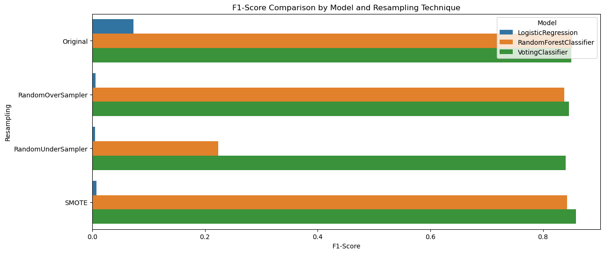
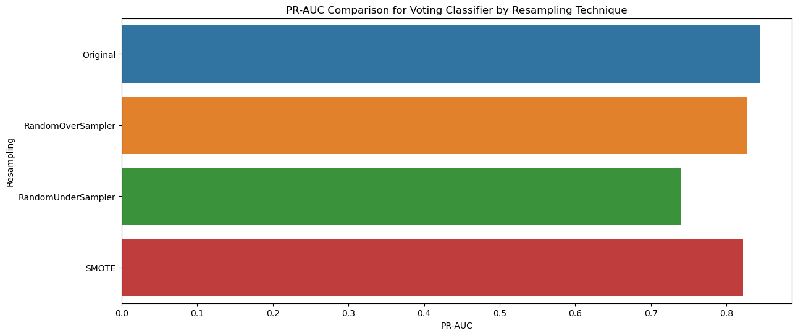
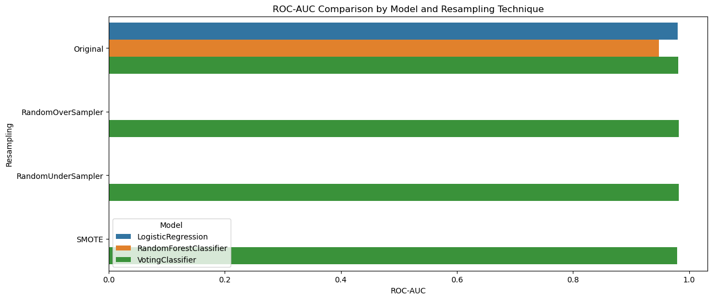
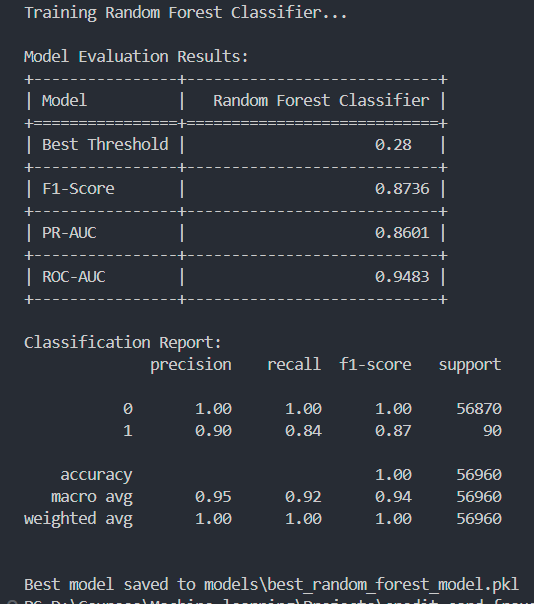
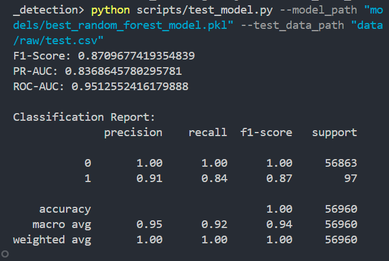

# Credit Card Fraud Detection


[](https://github.com/ellerbrock/open-source-badges/)

## Table of Contents

- [Project Overview](#project-overview)
- [Dataset](#dataset)
- [Models and Methods](#models-and-methods)
- [Performance Metrics](#performance-metrics)
- [Best Performing Model](#best-performing-model)
- [Installation](#installation)
  - [Dependencies](#dependencies)
  - [Installing Dependencies](#installing-dependencies)
- [Usage](#usage)
- [Interpreting the Results](#interpreting-the-results)
- [Results](#results)
- [Future Improvements](#future-improvements)
- [Additional Notes](#additional-notes)
- [Contact](#contact)
- [License](#license)

## Project Overview

This project focuses on detecting credit card fraud using various machine learning models and sampling techniques to address data imbalance. The goal is to accurately identify fraudulent transactions to prevent financial losses.

## Dataset

Place the datasets in the `data/raw/` directory:

- **Training data**: `train.csv`
- **Validation data**: `val.csv`

## Models and Methods

The following models and sampling methods were evaluated:

1. **Original (no sampling)**
   - `LogisticRegression`
   - `RandomForestClassifier`
2. **RandomOverSampler**
   - `LogisticRegression`
   - `RandomForestClassifier`
3. **RandomUnderSampler**
   - `LogisticRegression`
   - `RandomForestClassifier`
4. **SMOTE (Synthetic Minority Over-sampling Technique)**
   - `VotingClassifier`

## Performance Metrics

Models were evaluated using:

- **F1-Score**: Harmonic mean of precision and recall.
- **PR-AUC**: Area Under the Precision-Recall Curve.
- **ROC-AUC**: Area Under the Receiver Operating Characteristic Curve.

| Method             | Model                  | F1-Score | PR-AUC  | ROC-AUC |
|--------------------|------------------------|----------|---------|---------|
| Original           | LogisticRegression     | 0.8143   | 0.7634  | 0.9811  |
| Original           | RandomForestClassifier | **0.8735**   | **0.8601**  | 0.9483  |
| RandomOverSampler  | LogisticRegression     | 0.8095   | 0.7571  | 0.9622  |
| RandomOverSampler  | RandomForestClassifier | 0.8604   | 0.8640  | 0.9650  |
| RandomUnderSampler | LogisticRegression     | 0.5654   | 0.4867  | **0.9831**  |
| RandomUnderSampler | RandomForestClassifier | 0.8248   | 0.7879  | 0.9793  |
| SMOTE              | VotingClassifier       | 0.8538   | 0.8260  | 0.9792  |

## Best Performing Model

The best performing model is the `RandomForestClassifier` with the original dataset (no sampling). It achieved the highest F1-Score and PR-AUC, indicating strong overall performance. This model is saved as `models/new_best_model.pkl`.

## Installation

### Dependencies

Ensure you have the following Python libraries installed:

- **Python** >= 3.9
- **scikit-learn**
- **pandas**
- **numpy**
- **imbalanced-learn** (for SMOTE and other sampling techniques)

### Installing Dependencies

Use pip to install the dependencies:

```bash
pip install scikit-learn pandas numpy imbalanced-learn
```


## Usage

To train and evaluate the models, run the following command:

```bash
./credit_fraud_train.py --train_path "path/to/train.csv" --val_path "path/to/val.csv" --output_results "results.pkl"

```

Replace `path/to/train.csv` and `path/to/val.csv` with the actual paths to your training and validation datasets.

For testing the best model on the test dataset, you can run the following command:

```bash
./credit_fraud_test.py --test_path "path/to/test.csv" --model_path "path/to/best_model.pkl" --output_predictions "test_model.csv"
```

## Dependencies

Ensure you have the following Python libraries installed:
- scikit-learn
- pandas
- numpy
- imbalanced-learn (for SMOTE and other sampling techniques)

You can install these dependencies using pip:

```
pip install scikit-learn pandas numpy imbalanced-learn
```

## Interpreting the Results

- **F1-Score**: A measure of a model's accuracy that combines precision and recall. Higher values indicate better performance.
- **PR-AUC**: Area Under the Precision-Recall Curve. Higher values indicate better performance, especially for imbalanced datasets.
- **ROC-AUC**: Area Under the Receiver Operating Characteristic Curve. Higher values indicate better discrimination between classes.

## Results

Here are the results for some of the tested models:

1. **Original, LogisticRegression**
   - **F1-Score**: 0.8143
   - **PR-AUC**: 0.7634
   - **ROC-AUC**: 0.9811

2. **RandomOverSampler, LogisticRegression**
   - **F1-Score**: 0.8095
   - **PR-AUC**: 0.7571
   - **ROC-AUC**: 0.9622

3. **RandomOverSampler, RandomForestClassifier**
   - **F1-Score**: 0.8604
   - **PR-AUC**: 0.8640
   - **ROC-AUC**: 0.9650

4. **RandomUnderSampler, RandomForestClassifier**
   - **F1-Score**: 0.8248
   - **PR-AUC**: 0.7879
   - **ROC-AUC**: 0.9793

5. **SMOTE, VotingClassifier**
   - **F1-Score**: 0.8538
   - **PR-AUC**: 0.8260
   - **ROC-AUC**: 0.9792



## Best Performing Model

The best performing model is the `RandomForestClassifier` with the original dataset (no sampling). It achieved the highest F1-Score and PR-AUC, indicating strong overall performance. This model is saved as `models/new_best_model.pkl`.


After testing the best model on the test dataset,we can see the following result:




## Future Improvements

- **Explore Additional Algorithms**: Investigate algorithms like XGBoost or Neural Networks.
- **Hyperparameter Tuning**: Use Grid Search or Random Search for optimization.
- **Cross-Validation**: Implement cross-validation to improve robustness.
- **Feature Engineering**: Create new features to enhance model performance.
- **Analyze Misclassifications**: Study errors to identify patterns and improve accuracy.

## Additional Notes

The script automatically saves the results to a pickle file (results.pkl) for further analysis.
The best model is saved in the models/ directory for future use.
Experiment with different sampling techniques to address data imbalance.

## Contact

For any questions or feedback regarding this project, please open an issue in the GitHub repository or contact me at [LinkedIn](https://www.linkedin.com/in/sawsanabdulbari/)

## License

This project is licensed under the MIT License. See the [LICENSE](LICENSE) file for more details.